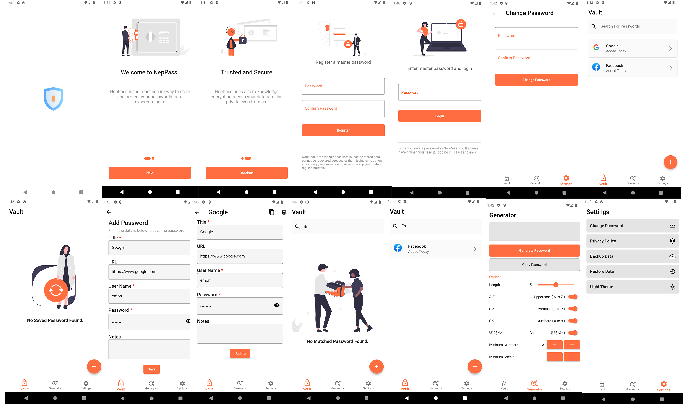

# Pass Vault

A new Flutter Password Vault and Generator project using Sqflite and Provider.

**Features:**

- Dark and Light Theme mode
- Save User Data to local Storage
- Search Passwords
- CRUD Passwords
- Generate Random Password
- Password Strength Meter
- Get Website Favicon

**Packages we are using:**

- form_field_validator: [link](https://pub.dev/packages/form_field_validator)
- persistent_bottom_nav_bar: [link](https://pub.dev/packages/persistent_bottom_nav_bar)
- provider: [link](https://pub.dev/packages/provider)
- sqflite: [link](https://pub.dev/packages/sqflite)
- shared_preferences: [link](https://pub.dev/packages/shared_preferences)
- cached_network_image: [link](https://pub.dev/packages/cached_network_image)
- favicon: [link](https://pub.dev/packages/favicon)
- intl: [link](https://pub.dev/packages/intl)
- path: [link](https://pub.dev/packages/path)
- flutter_svg: [link](https://pub.dev/packages/flutter_svg)
- webview: [link](https://pub.dev/packages/webview_flutter)

<!-- This is a complete functional application that works on both Android and iOS devices. -->

# Pass Vault App Final UI

**Light Mode**

 

 

 

**Night Mode**

 

 

 

 
 

# Change App Icon
## Package - flutter_launcher_icons: [link]( https://pub.dev/packages/flutter_launcher_icons)

- step 1 : Replace the logo.png image with your logo. 
- step 2 : Change the logo path in pubspec.yaml file 
- step 3 : Run "flutter pub get" 
- step 4 : Run "flutter pub run flutter_launcher_icons:main"

# Change Splash Screen
## Package - flutter_native_splash: [link]( https://pub.dev/packages/flutter_native_splash)

- step 1 : Replace the logo.png image with your logo. 
- step 2 : Change the logo path in pubspec.yaml file 
- step 3 : Run "flutter pub clean"
- step 4 : Run "flutter pub get" 
- step 5 : Run "flutter pub run flutter_native_splash:create" 

# Update Pods
## Run All Commands

 
cd ios

pod cache clean --all

rm Podfile.lock

rm -rf .symlinks/

cd ..

flutter clean

flutter pub get

cd ios

pod update

pod repo update

pod install --repo-update

pod update

pod install

cd ..

## You must be in your application directory to run those commands