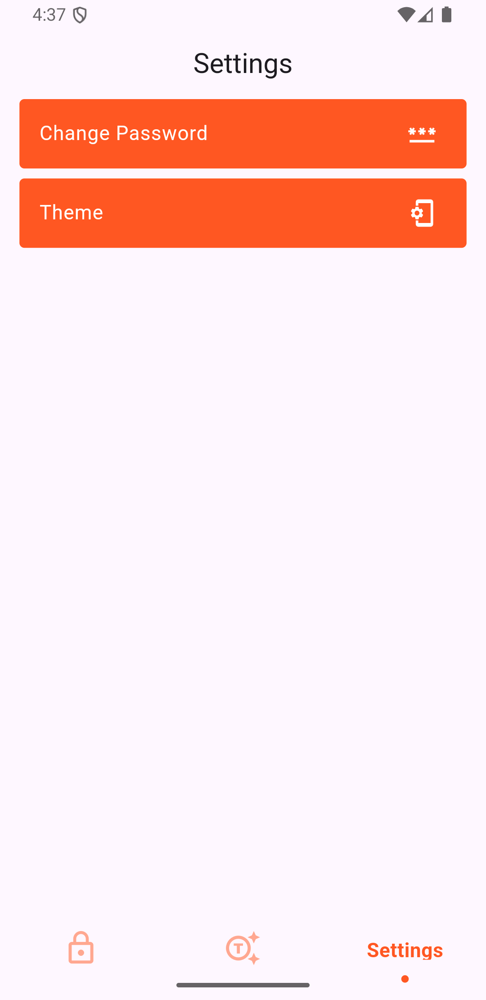

# Pass Vault

[](https://github.com/Emon526/Flutter_PassVault/blob/master/LICENSE)
[](https://github.com/Emon526/Flutter_PassVault/issues)
[](https://github.com/Emon526/Flutter_PassVault/network)
[](https://github.com/Emon526/Flutter_PassVault/stargazers)
[](https://github.com/Emon526/Flutter_PassVault/actions/workflows/release.yml)

## Overview

**Pass Vault** is a sophisticated Flutter application designed to securely manage and generate passwords. This project leverages Flutter's capabilities for cross-platform compatibility, ensuring seamless operation on both Android and iOS devices.

## Table of Contents

- [Features](#features)
- [Packages Utilized](#packages-utilized)
- [Application Compatibility](#application-compatibility)
- [Installation Instructions](#installation-instructions)
- [Usage Instructions](#usage-instructions)
- [Application Demonstration](#application-demonstration)
- [App Screenshots](#app-screenshots)
- [Change App Icon](#change-app-icon)
- [Change Splash Screen](#change-splash-screen)
- [Update Pods](#update-pods)
- [Troubleshooting](#troubleshooting)
- [Contribution Guidelines](#contribution-guidelines)
- [Contact Information](#contact-information)

## Features

- **Data Security**: Implement robust encryption and secure storage solutions to safeguard user data.
- **User-Friendly Interface**: An intuitive design that enhances user experience and accessibility.
- **Password Management**: Effortlessly create, store, and manage passwords with ease.
- **Password Generation**: Generate strong, random passwords to enhance security.
- **Search Functionality**: Quickly locate passwords with an efficient search feature.
- **Customizable Themes**: Choose between light and dark themes to suit user preferences.

## Packages Utilized

This project utilizes the following packages:

- **flutter**: The core Flutter SDK for building the application.
- **intl**: A package for internationalization and localization.
- **sqflite**: A SQLite plugin for local database storage.
- **cupertino_icons**: Provides iOS-style icons for the application.
- **provider**: A state management package that enhances the efficiency of app state handling.
- **shared_preferences**: A package for storing simple data in key-value pairs.
- **flutter_native_splash**: Facilitates the creation of native splash screens for the application.

## Application Compatibility

This application is fully functional and compatible with both Android and iOS devices.

## Installation Instructions

To set up the project, ensure you have Flutter installed on your machine. For detailed installation guidance, please refer to the [official Flutter installation guide](https://flutter.dev/docs/get-started/install).

1. Clone the repository:
   ```bash
   git clone https://github.com/Emon526/Flutter_PassVault.git
   cd Pass-Vault
   ```
2. Install the necessary dependencies:
   ```bash
   flutter pub get
   ```

## Usage Instructions

To run the application, execute the following command:

```bash
flutter run
```

## Application Demonstration

The following demonstration showcases the key features of the Pass Vault application, including password management, secure data entry, and theme selection.

<center>
    
</center>

## App Screenshots

### Onboarding & Authentication

The initial screens users encounter when launching and setting up the app.

#### Splash & Introduction

First impressions and onboarding experience:

<div style="text-align: center;">
  
  
  
  
</div>

<div style="text-align: center;">
  
  
  
  
</div>

#### Authentication

Secure access and account management:

<div style="text-align: center;">
  
  
  
  
</div>

### Main Features

Core functionality and primary user interface:

<div style="text-align: center;">
  
  
  
  
</div>

### Password Management

Tools for managing and generating secure passwords:

<div style="text-align: center;">
  
  
  
  
</div>

### Settings & Customization

App configuration and personalization options:

<div style="text-align: center;">
  
  
  
  
</div>

### App States

Different states and visual modes of the application.

#### Theme Selection

Theme customization options:

<div style="text-align: center;">
  
  
</div>

#### Empty States

Placeholder screens when no data is available:

<div style="text-align: center;">
  
  
</div>

## Change App Icon

### Package - flutter_launcher_icons: [link](https://pub.dev/packages/flutter_launcher_icons)

1. Replace the `logo.png` image with your logo.
2. Change the logo path in the `pubspec.yaml` file.
3. Run:
   ```bash
   flutter pub get
   ```
4. Run:
   ```bash
   flutter pub run flutter_launcher_icons:main
   ```

## Change Splash Screen

### Package - flutter_native_splash: [link](https://pub.dev/packages/flutter_native_splash)

1. Replace the `logo.png` image with your logo.
2. Change the logo path in the `pubspec.yaml` file.
3. Run:
   ```bash
   flutter pub clean
   ```
4. Run:
   ```bash
   flutter pub get
   ```
5. Run:
   ```bash
   flutter pub run flutter_native_splash:create
   ```

## Update Pods

### Run All Commands

```bash
cd ios
pod cache clean --all
rm Podfile.lock
rm -rf .symlinks/
cd ..
flutter clean
flutter pub get
cd ios
pod update
pod repo update
pod install --repo-update
pod update
pod install
cd ..
```

## Troubleshooting

If you encounter issues while using the application, consider the following solutions:

- **Common Issues**:
  - If the app crashes on startup, ensure all dependencies are correctly installed and up to date.
  - If you experience issues with the database, try running `flutter clean` and then `flutter pub get`.

## Contribution Guidelines

We welcome contributions! If you wish to contribute to the Pass Vault project, please follow these steps:

1. Fork the repository.
2. Create a new branch for your feature or bug fix.
3. Implement your changes and commit them.
4. Push your changes to your forked repository.
5. Submit a pull request detailing your modifications.

## Contact Information

For any inquiries or support, please reach out to [developer.asrafulislam@gmail.com](mailto:developer.asrafulislam@gmail.com).
