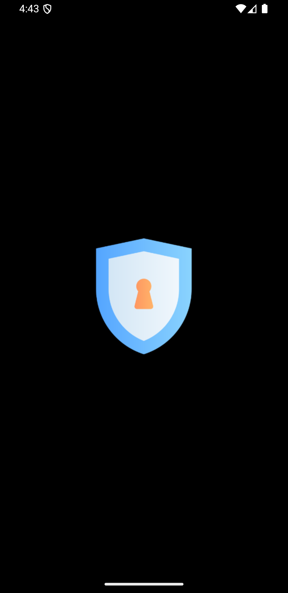

# Pass Vault

A new Flutter Password Vault and Generator project using Sqflite and Provider.

**Features:**

- Dark and Light Theme mode
- Save User Data to local Storage
- Search Passwords
- CRUD Passwords
- Generate Random Password
- Password Strength Meter
- Get Website Favicon

**Packages we are using:**

- form_field_validator: [link](https://pub.dev/packages/form_field_validator)
- persistent_bottom_nav_bar: [link](https://pub.dev/packages/persistent_bottom_nav_bar)
- provider: [link](https://pub.dev/packages/provider)
- sqflite: [link](https://pub.dev/packages/sqflite)
- shared_preferences: [link](https://pub.dev/packages/shared_preferences)
- cached_network_image: [link](https://pub.dev/packages/cached_network_image)
- favicon: [link](https://pub.dev/packages/favicon)
- intl: [link](https://pub.dev/packages/intl)
- path: [link](https://pub.dev/packages/path)
- flutter_svg: [link](https://pub.dev/packages/flutter_svg)
- webview: [link](https://pub.dev/packages/webview_flutter)

<!-- This is a complete functional application that works on both Android and iOS devices. -->

# Pass Vault App UI Preview

The app features a modern, clean interface with both light and dark themes. Below are the screenshots organized by functionality, showing both theme variations side by side for easy comparison.

## Table of Contents

- [Onboarding & Authentication](#onboarding--authentication)
  - [Splash & Introduction](#splash--introduction)
  - [Authentication](#authentication)
- [Main Features](#main-features)
- [Password Management](#password-management)
- [Settings & Customization](#settings--customization)
- [App States](#app-states)
  - [Theme Selection](#theme-selection)
  - [Empty States](#empty-states)

## App Screenshots

### Onboarding & Authentication

The initial screens users encounter when launching and setting up the app.

#### Splash & Introduction

First impressions and onboarding experience:

  
  
  
  

  
  
  
  

#### Authentication

Secure access and account management:

  
  
  
  

### Main Features

Core functionality and primary user interface:

  
  
  
  

### Password Management

Tools for managing and generating secure passwords:

  
  
  
  

### Settings & Customization

App configuration and personalization options:

  
  
  
  

### App States

Different states and visual modes of the application.

#### Theme Selection

Theme customization options:

  
  

#### Empty States

Placeholder screens when no data is available:

  
  

# Change App Icon

## Package - flutter_launcher_icons: [link](https://pub.dev/packages/flutter_launcher_icons)

- step 1 : Replace the logo.png image with your logo.
- step 2 : Change the logo path in pubspec.yaml file
- step 3 : Run "flutter pub get"
- step 4 : Run "flutter pub run flutter_launcher_icons:main"

# Change Splash Screen

## Package - flutter_native_splash: [link](https://pub.dev/packages/flutter_native_splash)

- step 1 : Replace the logo.png image with your logo.
- step 2 : Change the logo path in pubspec.yaml file
- step 3 : Run "flutter pub clean"
- step 4 : Run "flutter pub get"
- step 5 : Run "flutter pub run flutter_native_splash:create"

# Update Pods

## Run All Commands

 
cd ios

pod cache clean --all

rm Podfile.lock

rm -rf .symlinks/

cd ..

flutter clean

flutter pub get

cd ios

pod update

pod repo update

pod install --repo-update

pod update

pod install

cd ..

## You must be in your application directory to run those commands
